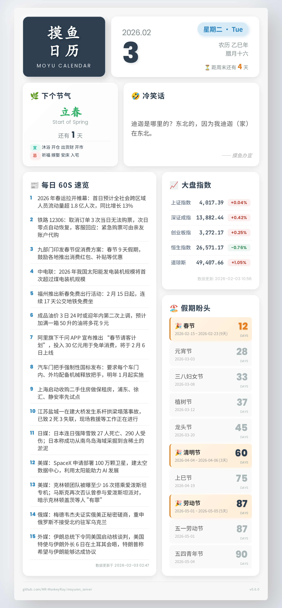

# 摸鱼人日历插件

一个功能完善的 AstrBot 摸鱼人日历插件，支持精确定时发送、多群组不同时间设置，并提供多种精美排版样式。

## 效果展示



## 安装

### 通过 AstrBot 插件市场安装（推荐）

1. 在 AstrBot 控制台中打开插件市场
2. 搜索"摸鱼人日历"
3. 点击安装

### 手动安装

1. 克隆或下载本仓库到 AstrBot 的插件目录
2. 安装依赖：

```bash
pip install -r requirements.txt
```

## 功能特点

- 精确定时发送，无需轮询检测
- 支持多群组不同时间设置
- 提供多种精美排版样式，每次按顺序选择
- 智能图片缓存，同一天复用减少API调用
- 支持立即发送功能
- 自动备份异常配置文件
- 多API源支持，自动故障转移
- 显示下一次发送的等待时间
- 支持通过配置文件自定义API端点和消息模板

## 使用说明

### 命令列表

- `/set_time HH:MM` - 设置发送时间，格式为24小时制（别名：设置摸鱼时间）
  - 例如：`/set_time 09:30` 或 `/set_time 0930`
  - 设置成功后会显示下一次发送的等待时间
- `/clear_time` - 取消当前群聊的定时设置（别名：清除摸鱼时间）
- `/list_time` - 查看当前群聊的时间设置（别名：查看摸鱼时间）
- `/next_time` - 查看下一次执行的时间（别名：下次摸鱼时间）
- `/execute_now` - 立即发送摸鱼人日历（别名：立即摸鱼、摸鱼日历）
- `/moyuren_help` - 显示帮助信息（别名：摸鱼帮助）

> 注意：`set_time` 和 `clear_time` 命令在群聊中仅群管理员或群主可执行，私聊无限制。

### 配置文件

插件支持通过 AstrBot 控制台的配置管理界面自定义 API 端点列表、消息模板、请求超时时间等设置。

## 常见问题

Q: 为什么显示获取图片失败？
A: 插件使用了多个备用API源，如果都获取失败，可能是网络连接问题或API服务暂时不可用。可以尝试在配置里增加超时时间，如果持续失败请提交 issue。

Q：样式我不喜欢怎么办，我想固定一个样式，可以吗？
A：可以的，在 AstrBot 控制台的配置界面中编辑模板列表，只保留你喜欢的模板即可。

## 更新日志

### v3.1.2

- 🔧 **图片缓存重构**：优化图片缓存机制

### v3.1.1

- 🐛 **Bug 修复**：修复 GitHub workflows 问题
- 🔧 **自动标签**：PR 合并到 main 时自动打 tag

### v3.1.0

- 🎨 **模板系统简化**：移除 `default_template` 配置项，简化配置结构
- ✨ **丰富默认模板**：从 4 个扩展到 10 个不同风格的摸鱼提示模板
- 🔧 **配置优化**：模板只需 `format` 字段，移除冗余的 `name` 字段
- 📝 **默认行为调整**：`enable_message_template` 默认值改为 true
- 🛠️ **逻辑优化**：无有效模板时仅发送图片，不再强制使用默认模板
- 🕐 **定时发送优化**：同一分钟内多群发送时，自动添加 1-5 秒随机延迟，避免消息过于密集
- ✅ **测试增强**：新增模板处理逻辑测试

### v3.0.0 🎉 重大重构版本

- 🏗️ **代码架构重构**：采用分层架构设计，提升代码可维护性
  - `models/` - 数据模型层
  - `core/` - 核心业务逻辑层（config, image, scheduler）
  - `handlers/` - 命令处理层
  - `utils/` - 工具模块层（paths, constants, decorators）
- 🔧 **模块化改进**：
  - 提取公共装饰器到 `utils/decorators.py`
  - 统一路径管理到 `utils/paths.py`
  - 集中常量定义到 `utils/constants.py`
- 🚀 **配置迁移**：新增 `migrate_legacy_config()` 函数，自动迁移旧版配置
- 📦 **导入优化**：使用相对导入，提升模块加载稳定性
- 🧹 **代码清理**：移除导入时的副作用，所有初始化操作封装到函数中
- 📝 **日志统一**：统一使用 `astrbot.api.logger`
- ✅ **测试框架**：建立完整的单元测试框架

更早版本请查看 git log。

## 支持与反馈

- 提交 Issue：[GitHub Issues](https://github.com/MR-MonkeyRay/astrbot_plugin_moyuren/issues)
- 帮助文档：[AstrBot 官方文档](https://astrbot.app/dev/plugin.html)
